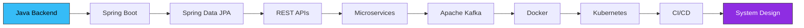
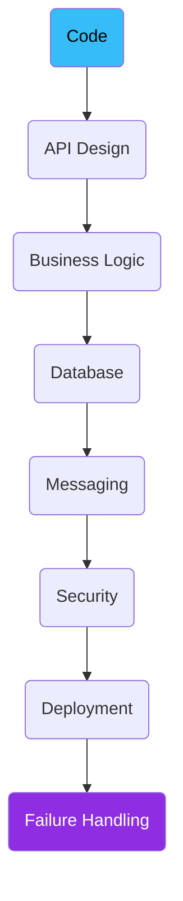

<!-- ========================= -->
<!--       ANIMATED HEADER      -->
<!-- ========================= -->

<div align="center">


<a href="https://git.io/typing-svg">

</a>

<br/>


</div>

<br/>

<!-- ========================= -->
<!--        ABOUT ME            -->
<!-- ========================= -->

## 🧠 About Me


I'm a **backend-focused Java developer** who enjoys understanding what happens behind the API rather than stopping at the controller layer.

My primary stack revolves around:

```
Java  ➜  Spring Boot  ➜  Spring Data JPA  ➜  REST APIs  ➜  SQL  ➜  Docker  ➜  Kafka  ➜  Microservices
```

- 🎓 Currently pursuing my **Master of Computer Applications (MCA)**
- 🔍 I like understanding systems across every layer — code, APIs, databases, messaging, infra & failure scenarios
- 🏗️ Interested in building maintainable backends with proper architecture, security, DB design & async processing
- 🐧 I develop entirely on **Linux (Fedora)**

<br clear="right"/>

---

## 🎯 Current Focus

<div align="center">



</div>

---

<!-- ========================= -->
<!--        TECH STACK          -->
<!-- ========================= -->

# 💻 Tech Stack

<table width="100%">
<tr>
<td width="50%" valign="top">

### ☕ Backend

<p align="left">

</p>

`Java` `Spring Boot` `Spring Data JPA` `Hibernate` `Maven` `REST API` `Microservices`

</td>
<td width="50%" valign="top">

### 🌐 Frontend

<p align="left">

</p>

`HTML` `CSS` `JavaScript` `React` `Vite`

</td>
</tr>
<tr>
<td width="50%" valign="top">

### 🗄️ Databases

<p align="left">

</p>

`MySQL` `PostgreSQL` `MongoDB` `SQL` `JPA` `Redis`

</td>
<td width="50%" valign="top">

### 📨 Messaging & Distributed Systems

<p align="left">

</p>

`Apache Kafka` `Event-Driven Architecture` `Async Communication`

</td>
</tr>
<tr>
<td width="50%" valign="top">

### 🐳 DevOps & Infra

<p align="left">

</p>

`Docker` `Kubernetes` `GitHub Actions` `AWS` `Linux`

</td>
<td width="50%" valign="top">

### 🛠️ Dev Tools

<p align="left">

</p>

`Git` `GitHub` `Postman` `IntelliJ IDEA` `VS Code` `Bash` `PowerShell`

</td>
</tr>
</table>

---

# 🧪 Development Approach

<div align="center">



</div>

My focus is on writing software that is **clean, maintainable and understandable**, while learning how systems behave under real-world conditions.

---

# 📚 Education

<table width="100%">
<tr>
<td width="50%">

### 🎓 MCA
**Shri Ram Institute of Technology, Jabalpur**
Currently pursuing — focus on software development & backend engineering.

</td>
<td width="50%">

### 🎓 BCA
**St. Aloysius' College (Autonomous), Jabalpur**
Completed with an overall CGPA of ~**8.51**

</td>
</tr>
</table>

---

# 🔥 DSA & Problem Solving

Actively improving problem-solving skills through **DSA and LeetCode**.

`Arrays` `Hashing` `Two Pointers` `Sliding Window` `Binary Search` `Stack` `Queue` `Trees` `Graphs` `Dynamic Programming`

<div align="center">

</div>


---

# 📈 GitHub Statistics

<div align="center">


<br/>


</div>

---

# 🏆 GitHub Trophies

<div align="center">

</div>

---

# 📊 Contribution Activity

<div align="center">

</div>

---

# 🐍 Contribution Snake

<div align="center">

</div>

---

# 🌐 Connect With Me

<div align="center">

<a href="https://www.linkedin.com/in/raahullkushwaha/">

</a>
<a href="https://raahullkushwaha.dev/">

</a>
<a href="https://instagram.com/raahullkushwaha">

</a>
<a href="mailto:raahullkushwaha@gmail.com">

</a>

</div>

---

# 💬 Let's Connect

I'm open to:

**Backend Development • Java • Spring Boot • Microservices • System Design • DevOps • Open Source • Technical Collaboration**

📩 **Email:** [raahullkushwaha@gmail.com](mailto:raahullkushwaha@gmail.com)
🌐 **Portfolio:** https://raahullkushwaha.dev/
💼 **LinkedIn:** https://www.linkedin.com/in/raahullkushwaha/

---

<div align="center">

### ⚡ Code. Understand. Build. Improve.

<br/>


</div>

<!-- ========================= -->
<!--      END OF README        -->
<!-- ========================= -->
